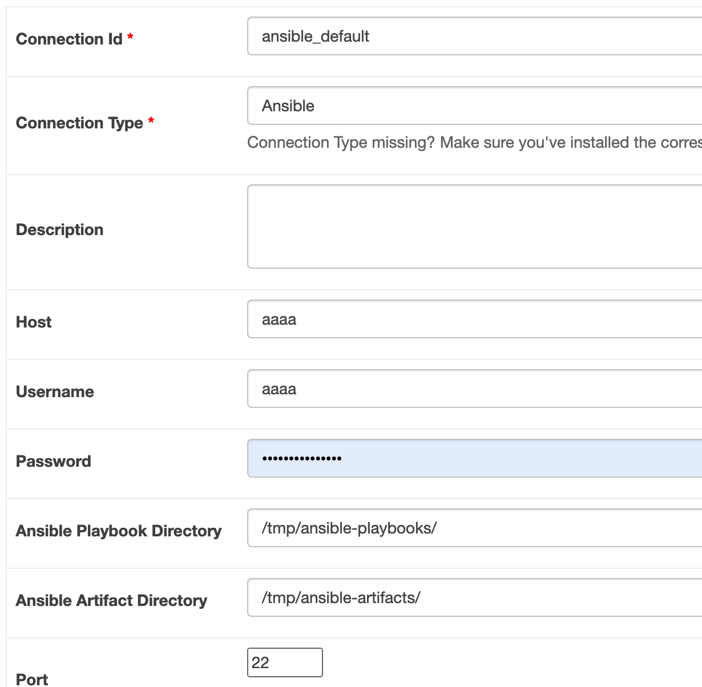
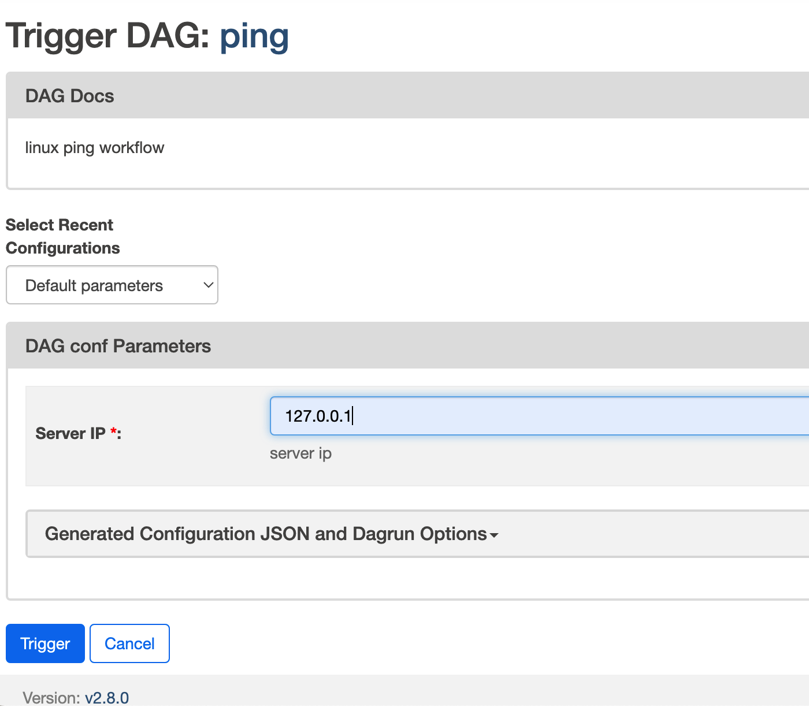
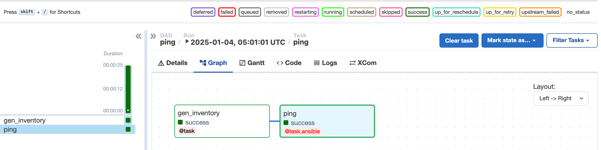
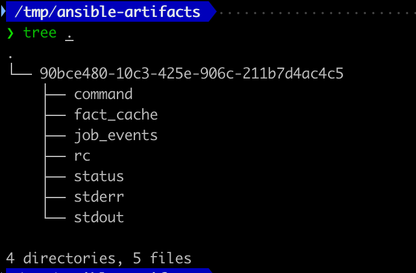

# Install
```
pip install airflow-ansible-provider
```

# Connection Setting
Add `ansible` Airflow Connections in your airflow system 



# DAG Example
```python
from airflow_ansible_provider.decorators.ansible_decorators import ansible_task

@ansible_task(
    task_id="ping",
    playbook="ping.yml",
    get_ci_events=True,
)
def ping(inventory):  # pylint: disable=unused-argument
    """Collect ansible run results"""
    return get_current_context().get("ansible_return", {})
```

# Anisble Playbook
```yaml
---
- hosts: default
  gather_facts: False
  tasks:
    - ping:
      async: 10
```

# DAGRUN



# XCOM
## runner_id 
90bce480-10c3-425e-906c-211b7d4ac4c5 
## ansible_return
```json
{
    "canceled": False,
    "directory_isolation_cleanup": True,
    "directory_isolation_path": None,
    "errored": False,
    "last_stdout_update": 1735966892.7891042,
    "process_isolation": False,
    "process_isolation_path_actual": None,
    "rc": 4,
    "remove_partials": True,
    "runner_mode": "pexpect",
    "stats": None,
    "status": "failed",
    "timed_out": False,
    "artifact_dir": "/tmp/ansible-artifacts/90bce480-10c3-425e-906c-211b7d4ac4c5",
    "command": [
        "ansible-playbook",
        "-i",
        "/var/folders/4v/hg71f_k557n3b9tmz2xx43w80000gn/T/tmpxkwv1ha5/inventory/hosts.json",
        "-e",
        "@/var/folders/4v/hg71f_k557n3b9tmz2xx43w80000gn/T/tmpxkwv1ha5/env/extravars",
        "--forks",
        "10",
        "ping.yml"
    ],
    "cwd": "/tmp/ansible-playbooks/",
    "fact_cache": "/tmp/ansible-artifacts/90bce480-10c3-425e-906c-211b7d4ac4c5/fact_cache",
    "fact_cache_type": "jsonfile",
    "ident": "90bce480-10c3-425e-906c-211b7d4ac4c5",
    "inventory": "/var/folders/4v/hg71f_k557n3b9tmz2xx43w80000gn/T/tmpxkwv1ha5/inventory/hosts.json",
    "playbook": "ping.yml",
    "private_data_dir": "/var/folders/4v/hg71f_k557n3b9tmz2xx43w80000gn/T/tmpxkwv1ha5",
    "project_dir": "/tmp/ansible-playbooks/",
    "last_event": {},
    "ci_events": {
        "test": {
            "uuid": "bd47e4ff-1b2e-46d7-8d2f-a9c78e1bcbe5",
            "counter": 9,
            "stdout": "\x1b[1;31mfatal: [test]: UNREACHABLE! => {"changed": false, "msg": "Failed to connect to the host via ssh: ssh: connect to host 127.0.0.1 port 22: Connection refused", "unreachable": true}\x1b[0m",
            "start_line": 8,
            "end_line": 9,
            "runner_ident": "90bce480-10c3-425e-906c-211b7d4ac4c5",
            "event": "runner_on_unreachable",
            "pid": 26691,
            "created": "2025-01-04T05:01:32.616738",
            "parent_uuid": "d0a637ef-2fe5-1a12-59c0-000000000008",
            "event_data": {
                "playbook": "ping.yml",
                "playbook_uuid": "cac671f5-0d3c-4f0a-a7c9-e321ed68d8b1",
                "play": "default",
                "play_uuid": "d0a637ef-2fe5-1a12-59c0-000000000006",
                "play_pattern": "default",
                "task": "ping",
                "task_uuid": "d0a637ef-2fe5-1a12-59c0-000000000008",
                "task_action": "ping",
                "resolved_action": "ansible.builtin.ping",
                "task_args": "",
                "task_path": "/private/tmp/ansible-playbooks/ping.yml:5",
                "host": "test",
                "remote_addr": "test",
                "start": "2025-01-04T05:01:32.583591",
                "end": "2025-01-04T05:01:32.616161",
                "duration": 0.03257,
                "res": {
                    "unreachable": True,
                    "msg": "Failed to connect to the host via ssh: ssh: connect to host 127.0.0.1 port 22: Connection refused",
                    "changed": False
                },
                "uuid": "bd47e4ff-1b2e-46d7-8d2f-a9c78e1bcbe5"
            }
        }
    }
}
```

# Ansible Artifacts

